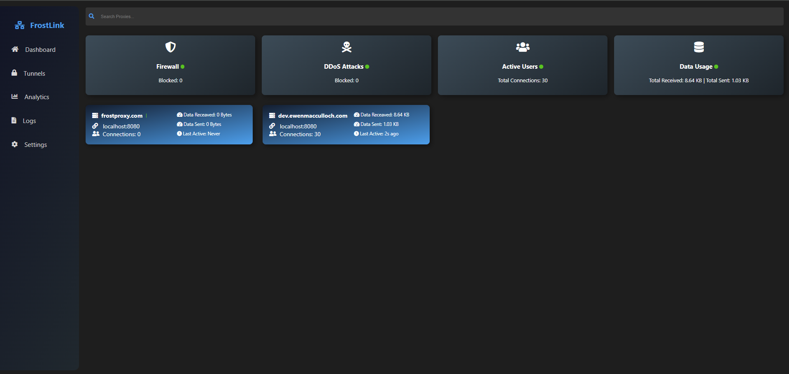

# ArcticArch

ArcticArch is a powerful and flexible reverse proxy tool developed in Rust. It's designed to route requests efficiently from public domains to local servers, supporting both HTTP and HTTPS traffic. ArcticArch is particularly useful for exposing local development servers to the internet or for setting up a custom routing scheme in a microservices architecture.

## Features

- **Support for HTTP and HTTPS**: Handles both unencrypted and encrypted traffic, with easy SSL/TLS setup.
- **Dynamic Configuration**: Configure your domains and SSL settings using simple `.conf` files.
- **Asynchronous Processing**: Utilizes Rust's async capabilities for efficient handling of multiple connections.
- **Detailed Logging**: Logs information about each request, including processing time, client IP address, domain, and request path.
- **Customizable**: Extendable for various use cases and easily integrable into different environments.

## Getting Started

### Configuration

ArcticArch requires domain configuration files to be placed in the `./domains` directory. Each file should have the `.conf` extension and follow this structure:

### Running the Proxy

1. **Set Up Configuration Files:** Create `.conf` files for each domain in the `./domains` directory.
2. **Start ArcticArch:** Execute the main program. By default, it listens on ports 80 (HTTP) and 443 (HTTPS).
3. **Monitor Activity:** Observe the console output for logs detailing requests and server activity.

### Example Configuration File

example.conf
```plaintext
server: {
    domain: example.com
    location: localhost:3000

    connection: {
        AllowSSL: true
        AllowHTTP: true
    }
}

SSLCert: {
    ssl_certificate: /etc/letsencrypt/live/example.com/fullchain.pem
    ssl_certificate_key: /etc/letsencrypt/live/example.com/privkey.pem
}
```

### Dashboard

ArcticArch includes a user-friendly dashboard for easy monitoring and management. Here's a glimpse of what the dashboard looks like:

<p align="center">
    
</p>

### Contributing
Feel free to open issues or submit pull requests if you have ideas or encounter issues. Contributions are always welcome!

### License
FrostLink is open-source software, and its license information can be found in the LICENSE file in the repository.